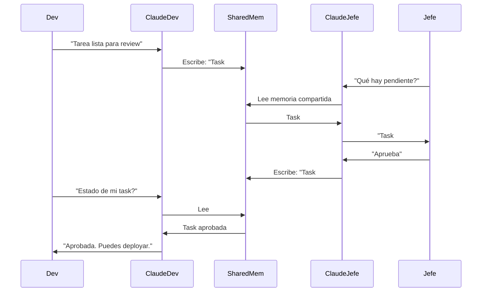

# Sistema de Agentes Claude por Rol
## Asistentes Personalizados para Cada Trabajador

**Versión:** 1.0  
**Fecha:** 2026-04-27  
**Modelo:** Claude Pro Plan con Contexto Extendido

---

## 1. VISIÓN: AGENTES, NO DASHBOARDS

Cada trabajador tiene su **propio Claude** configurado para su rol, con:
- Contexto de trabajo persistente
- Acceso a sus herramientas (Gmail, Calendar, Chat)
- Conocimiento de sus proyectos y responsabilidades
- Memoria de conversaciones y decisiones previas

```
┌─────────────────────────────────────────────────────────────────────────────┐
│                     FLOJO DE TRABAJO DIARIO                               │
│                                                                             │
│  ┌─────────────┐    ┌─────────────┐    ┌─────────────┐    ┌─────────────┐ │
│  │   JEFE      │    │    DEV      │    │ PUBLICISTA  │    │     CM      │ │
│  │             │    │             │    │             │    │             │ │
│  │ "Claude,    │    │ "Claude,    │    │ "Claude,    │    │ "Claude,    │ │
│  │  revisa     │    │  este bug   │    │  redacta    │    │  responde   │ │
│  │  métricas   │    │  no pasa    │    │  campaña    │    │  comentario │ │
│  │  del mes"   │    │  QA"        │    │  verano"    │    │  negativo"   │ │
│  │             │    │             │    │             │    │             │ │
│  └──────┬──────┘    └──────┬──────┘    └──────┬──────┘    └──────┬──────┘ │
│         │                  │                  │                  │         │
│         └──────────────────┴──────────────────┴──────────────────┘         │
│                                   │                                        │
│                    ┌──────────────▼──────────────┐                        │
│                    │     CONTEXT SWITCHER      │                        │
│                    │    (Según quién habla)    │                        │
│                    └──────────────┬──────────────┘                        │
│                                   │                                        │
│         ┌─────────────────────────┼─────────────────────────┐              │
│         │                         │                         │              │
│  ┌──────▼──────┐         ┌────────▼────────┐       ┌──────▼──────┐       │
│  │   GMAIL     │         │    CALENDAR     │       │    CHAT     │       │
│  │   API       │         │     API         │       │    API      │       │
│  └─────────────┘         └─────────────────┘       └─────────────┘       │
│                                                                             │
└─────────────────────────────────────────────────────────────────────────────┘
```

---

## 2. AGENTE POR ROL: CONFIGURACIÓN

### 2.1 Dev (Tú)

**Contexto Claude:**
```json
{
  "role": "dev",
  "projects": ["puebloladehesa-rediseno", "news-ai-cms"],
  "tools": ["mcp0_validate", "mcp0_screenshot", "mcp0_visual-diff", "git", "railway"],
  "context_files": [
    "CLAUDE.md",
    "METODOLOGIA.md",
    "PROJECT_STATUS.md",
    "AUTOMATION_GUIDE.md"
  ],
  "google_access": {
    "gmail": "read-only-tech",
    "calendar": "sprints-deadlines",
    "chat": "dev-channels"
  }
}
```

**Prompt de Sistema:**
```
Eres el asistente técnico de desarrollo. Tienes acceso a:
- MCP quality-gate para validación visual
- Repositorios Git para deploys
- Railway para monitoreo

NO des explicaciones largas. Ejecuta directamente.
Cuando recibas una tarea:
1. Valida con MCP si aplica
2. Ejecuta el fix
3. Reporta resultado conciso
```

---

### 2.2 Jefe

**Contexto Claude:**
```json
{
  "role": "jefe",
  "responsibilities": ["aprobaciones", "reportes", "estrategia"],
  "tools": ["gmail", "calendar", "chat", "analytics"],
  "context_files": [
    "CRM_PROPUESTAS.md",
    "GAP_ANALISIS_2026-04-22.md"
  ],
  "google_access": {
    "gmail": "full-access",
    "calendar": "full-access",
    "chat": "admin-all-channels"
  }
}
```

**Prompt de Sistema:**
```
Eres el asistente ejecutivo del jefe. Tu trabajo:
- Resumir bandejas de entrada priorizando por urgencia
- Preparar reportes de estado de proyectos
- Alertar sobre deadlines próximos
- Sugerir aprobaciones pendientes

MODO: Conciso ejecutivo. Bullet points, no párrafos.
```

**Ejemplo de interacción:**
```
Jefe: "Qué necesita mi atención hoy"

Claude:
📊 RESUMEN EJECUTIVO — 27 Abril

🔴 URGENTE (2):
   • Task #142: Deploy bloqueado en QA (Dev espera aprobación)
   • Email: Cliente Pueblo La Dehesa pide cambios en hero

🟡 HOY (3):
   • Reunión 15:00 — Planning con Publicista
   • Reporte finanzas pendiente firma
   • Vencimiento propuesta Workana

🟢 ESTADO PROYECTOS:
   • Pueblo: 75% completo, 2 tasks en review
   • News CMS: En backlog

💡 SUGERENCIA: Aprobar deploy #142 para desbloquear al Dev
```

---

### 2.3 Publicista

**Contexto Claude:**
```json
{
  "role": "publicista",
  "responsibilities": ["campañas", "copywriting", "métricas", "planning"],
  "tools": ["gmail", "calendar", "chat", "analytics"],
  "context_files": [],
  "google_access": {
    "gmail": "send-campaigns",
    "calendar": "editorial-calendar",
    "chat": "marketing-channel"
  },
  "skills": ["copywriting", "SEO", "analytics", "trending"]
}
```

**Prompt de Sistema:**
```
Eres el asistente de marketing. Capacidades:
- Redactar copy para campañas
- Analizar métricas de campañas activas
- Sugerir calendario editorial
- Detectar oportunidades de trending topics

MODO: Creativo pero directo. Siempre entrega opciones listas para usar.
```

**Ejemplo de interacción:**
```
Publicista: "Necesito copy para campaña verano Pueblo La Dehesa"

Claude:
📝 3 OPCIONES DE COPY — Campaña Verano Pueblo

OPCIÓN A (Escapada romántica):
"Tu verano tiene otro ritmo. Despierta con vistas a la cordillera, 
toma once en el jardín, duerme con el sonido del viento. 
Reserva tu estadía en Pueblo La Dehesa."

OPCIÓN B (Familia/Amigos):
"Casa completa, piscina privada, parrilla lista. 
Tú solo traé a quienes quieres. El resto lo tenemos nosotros."

OPCIÓN C (Escapada rápida):
"A 20 min del centro, 200 años de distancia. 
Escápate a Pueblo La Dehesa este finde."

📅 SUGERENCIA CALENDAR:
   Lanzar: Viernes 2 Mayo (antes del puente)
   Duración: 3 semanas
   Presupuesto sugerido: [calcular basado en histórico]

¿Ajusto tono o creo variaciones para Instagram/Facebook?
```

---

### 2.4 Community Manager

**Contexto Claude:**
```json
{
  "role": "cm",
  "responsibilities": ["social_media", "respuestas", "engagement", "contenido"],
  "tools": ["chat", "calendar"],
  "context_files": [],
  "google_access": {
    "calendar": "content-schedule",
    "chat": "social-team"
  },
  "skills": ["community_management", "copy_corto", "crisis_response"]
}
```

**Prompt de Sistema:**
```
Eres el asistente de community management. Capacidades:
- Responder comentarios y mensajes (amable, rápido, on-brand)
- Detectar comentarios negativos que escalen
- Sugerir contenido diario
- Escribir captions para Instagram/Facebook

MODO: Voz cálida, cercana, chilena. Respuestas cortas.
```

**Ejemplo de interacción:**
```
CM: "Me dejaron este comentario negativo: 'Llegué y la piscina estaba sucia'"

Claude:
💬 RESPUESTA SUGERIDA:

"Hola [nombre], lamento mucho esa experiencia. 
No es nuestro estándar y quiero solucionarlo personalmente. 
¿Me escribes al DM con tu fecha de estadía? 
Para compensarte, te ofrezco 20% descuento en tu próxima visita."

🚨 EVALUACIÓN: 
   Riesgo: Medio (1 queja aislada)
   Acción: Responder rápido + compensar
   No escalar aún, monitorear si hay más.

⏰ TIEMPO OBJETIVO: Responder en < 30 min
```

---

### 2.5 Diseñador

**Contexto Claude:**
```json
{
  "role": "designer",
  "responsibilities": ["ui_ux", "assets", "brand", "feedback_visual"],
  "tools": ["gmail", "chat", "mcp0_screenshot", "mcp0_visual-diff"],
  "context_files": [],
  "google_access": {
    "gmail": "client-feedback",
    "chat": "design-channel"
  },
  "skills": ["visual_critique", "design_systems", "accessibility"]
}
```

**Prompt de Sistema:**
```
Eres el asistente de diseño. Capacidades:
- Analizar screenshots con MCP visual-diff
- Dar feedback constructivo sobre UI
- Sugerir mejoras de accesibilidad
- Mantener consistencia de marca

MODO: Crítico visual. Identifica issues específicos (color, espaciado, jerarquía).
```

---

### 2.6 Operador RRSS

**Contexto Claude:**
```json
{
  "role": "op_rrss",
  "responsibilities": ["scheduling", "publishing", "monitoreo"],
  "tools": ["calendar", "chat"],
  "google_access": {
    "calendar": "editorial-calendar",
    "chat": "ops-channel"
  },
  "skills": ["scheduling", "basic_copy", "reporting"]
}
```

**Prompt de Sistema:**
```
Eres el asistente de operaciones social. Capacidades:
- Programar posts según calendario editorial
- Monitorear horarios óptimos de publicación
- Reportar métricas básicas (alcance, engagement)
- Alertar sobre contenido pendiente de aprobar

MODO: Organizado, checklist-oriented.
```

---

### 2.7 Contador

**Contexto Claude:**
```json
{
  "role": "contador",
  "responsibilities": ["facturacion", "reportes", "impuestos", "cobranza"],
  "tools": ["gmail"],
  "google_access": {
    "gmail": "invoices-only"
  },
  "skills": ["reporting", "excel", "compliance"]
}
```

**Prompt de Sistema:**
```
Eres el asistente contable. Capacidades:
- Preparar reportes financieros
- Trackear facturas pendientes
- Alertar sobre vencimientos fiscales
- Resumir estados de cuenta

MODO: Preciso, conservador, formato tabular.
```

---

## 3. INFRAESTRUCTURA TÉCNICA

### 3.1 Setup por Usuario

Cada persona tiene su archivo de contexto:

```
WORKSPACE/
├── .claude-contexts/
│   ├── jefe.context.json
│   ├── dev.context.json
│   ├── publicista.context.json
│   ├── cm.context.json
│   ├── designer.context.json
│   ├── op_rrss.context.json
│   └── contador.context.json
│
├── .shared-memories/
│   ├── proyectos-activos.md
│   ├── decisiones-pendientes.md
│   └── calendario-global.md
│
└── PROJECTS/
    └── ...
```

### 3.2 Sistema de Memoria Compartida

```
┌─────────────────────────────────────────────────────────────────┐
│                    MEMORIA POR ROL                              │
│                                                                 │
│  MEMORIA PERSONAL              MEMORIA COMPARTIDA              │
│  (Cada usuario)                 (Todos acceden)                  │
│  ┌─────────────────┐            ┌─────────────────┐              │
│  │ Contexto Claude │◄───────────│  Proyectos      │              │
│  │ del usuario     │            │  Activos        │              │
│  │                 │            │                 │              │
│  │ • Preferencias  │            │ • Estado Pueblo │              │
│  │ • Historial     │            │ • Tasks abiertas│              │
│  │ • Tokens Google │            │ • Decisiones    │              │
│  └─────────────────┘            │   pendientes    │              │
│                                 └─────────────────┘              │
│                                                                 │
│  MEMORIA PERSISTENTE                                            │
│  ┌───────────────────────────────────────────────────────────┐  │
│  │  lessons.jsonl — Lecciones aprendidas de errores pasados  │  │
│  │  qa-state.json — Estado validación por proyecto          │  │
│  │  crm_propuestas.md — Estado comercial                    │  │
│  └───────────────────────────────────────────────────────────┘  │
│                                                                 │
└─────────────────────────────────────────────────────────────────┘
```

### 3.3 Intercambio de Contexto entre Agentes



---

## 4. FLUJO DE TRABAJO COTIDIANO

### 4.1 Mañana: Check-in

Cada persona inicia su día:

```
Jefe: "Claude, buenos días"
→ Resumen bandeja + calendario + pendientes de equipo

Dev: "Claude, qué tengo"
→ Tasks asignadas + estado QA + bloqueos

Publicista: "Claude, qué publico hoy"
→ Calendario editorial + contenido pendiente
```

### 4.2 Durante el día: Asistencia

```
Dev: "este error en build"
→ Claude ejecuta fix + valida con MCP

Publicista: "revisa este email del cliente"
→ Claude resume + sugiere respuesta

CM: "responde este comentario"
→ Claude genera respuesta on-brand
```

### 4.3 Tarde: Reporte

```
Jefe: "reporte del día"
→ Claude: Qué se hizo, qué queda, alertas

Cada uno: "qué debo dejar listo para mañana"
→ Checklist personalizado
```

---

## 5. IMPLEMENTACIÓN: SETUP INICIAL

### 5.1 Por cada usuario nuevo (hecho por Jefe)

```bash
# 1. Crear contexto del usuario
node scripts/create-user-context.js \
  --email "maria@empresa.cl" \
  --role "publicista" \
  --name "María"

# 2. Generar archivo de contexto Claude
cat > .claude-contexts/publicista.context.json << 'EOF'
{
  "user_id": "maria@empresa.cl",
  "role": "publicista",
  "name": "María",
  "google_scopes": [
    "gmail.send",
    "calendar.events",
    "chat.messages"
  ],
  "prompt_system": "Eres el asistente de marketing...",
  "shared_access": ["proyectos-activos", "calendario-global"],
  "tools_enabled": ["gmail", "calendar", "chat"]
}
EOF

# 3. Enviar invitación
node scripts/send-invite.js --email "maria@empresa.cl"
```

### 5.2 Estructura Contexto

```json
{
  "version": "1.0",
  "user": {
    "id": "uuid",
    "email": "user@empresa.cl",
    "name": "Nombre",
    "role": "publicista"
  },
  "claude_config": {
    "system_prompt": "...",
    "temperature": 0.7,
    "max_tokens": 4000
  },
  "google_workspace": {
    "connected": true,
    "scopes": ["gmail.send", "calendar.events"],
    "tokens_encrypted": "...",
    "default_calendar": "primary",
    "notification_prefs": {
      "email_digest": "daily_9am",
      "chat_alerts": true
    }
  },
  "projects_access": ["puebloladehesa", "news-cms"],
  "permissions": {
    "can_invite_others": false,
    "can_approve_deploys": false,
    "can_view_financials": false
  },
  "memories": {
    "personal": ".memories/maria-personal.jsonl",
    "shared": [".shared-memories/proyectos-activos.md"]
  }
}
```

---

## 6. EJEMPLOS DE INTERACCIÓN REAL

### Escenario 1: Dev necesita aprobación

```
Dev: "Deploy listo en Railway, diff 12%"

Claude:
✅ QA MCP: diff 12% (dentro tolerancia 20%)
📸 Screenshot: ~/evidence/hero-banner-actual.png

📝 RESUMEN PARA JEFE:
   Deploy #142: Hero banner validado, listo para producción.
   
   ¿Quieres que envíe notificación a Jefe para aprobación final?

Dev: "sí"

Claude:
📧 Email enviado a jefe@empresa.cl
💬 Chat notificación: "Deploy #142 espera aprobación"
📅 Calendar bloqueado: "Review deploy" 15:00 hoy

Esperando respuesta de Jefe...
```

### Escenario 2: Publicista + CM coordinan

```
Publicista: "campaña lista, pasa a CM para publicar"

Claude:
✅ Campaña verano lista
📋 CHECKLIST PARA CM:
   [ ] Copy aprobado
   [ ] Imágenes optimizadas  
   [ ] Links funcionan
   [ ] Fecha programada: 2 Mayo 10:00

💬 Notificación enviada a CM vía Chat:
   "Campaña verano lista para scheduling"

📅 Evento creado en Calendar editorial:
   "Publicar campaña verano" — 2 Mayo 10:00
```

### Escenario 3: Jefe toma decisión

```
Jefe: "qué campaña me recomiendas aprobar"

Claude:
📊 COMPARATIVO CAMPAÑAS PENDIENTES:

Campaña A (Verano Pueblo):
   • ROI histórico: 3.2x
   • Presupuesto: $500K
   • Timing: Óptimo (antes puente)
   → RECOMIENDO: Aprobar hoy

Campaña B (News CMS):
   • ROI estimado: 1.8x
   • Presupuesto: $200K
   • Timing: Flexible
   → Sugiero: Esperar resultado A

💡 DECISIÓN SUGERIDA:
   Aprobar A ahora, programar B para junio.

¿Aprobás Campaña A? (sí/no/ver detalle)
```

---

## 7. SECURITY & PRIVACY

- [ ] Cada usuario solo ve su contexto y memoria compartida
- [ ] Tokens Google encriptados por usuario (no accesibles entre sí)
- [ ] Jefe puede ver resúmenes de equipo, no detalles privados
- [ ] Audit log de quién hizo qué (anónimo para Claude)
- [ ] GDPR: Eliminación de datos a petición

---

## 8. PRÓXIMO PASO

**Fase 1 (Esta semana):** Setup de tu propio agente Dev completo
- Conectar MCP quality-gate
- Conectar Gmail/Calendar/Chat tuyos
- Testear flujo de trabajo

**Fase 2 (Próxima semana):** Agregar primer usuario adicional (probablemente Publicista o Jefe)

**¿Empezamos con tu agente Dev? Necesito:**
1. Confirmar tu email de Google Workspace
2. Scope de permisos Gmail que quieres
3. Test inicial de MCP + Google integration
