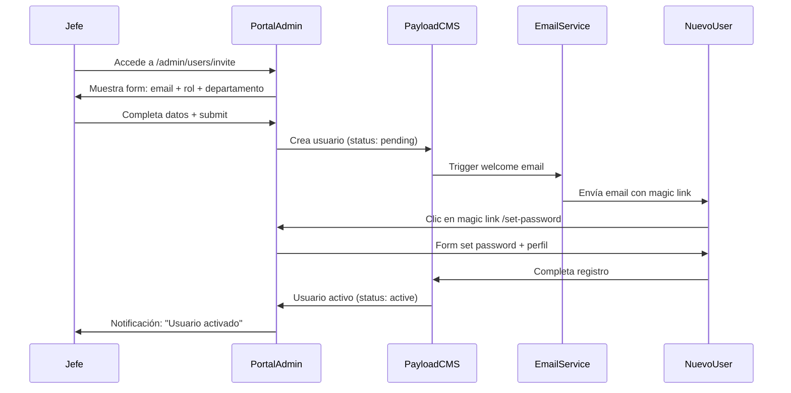
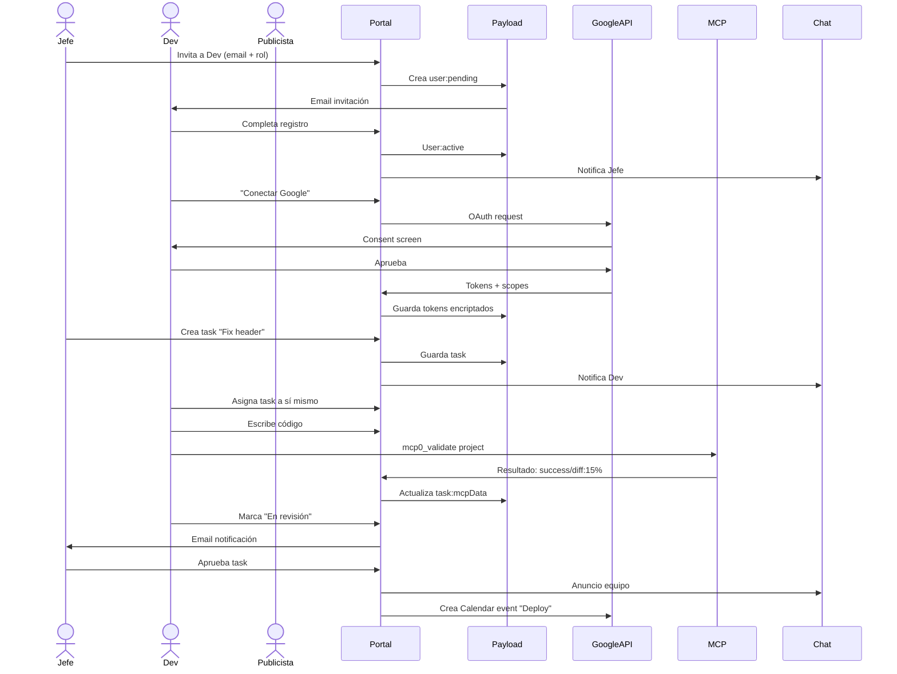

# Arquitectura de Entorno Colaborativo con Claude
## Sistema Multi-Rol para Empresa — Integración Google Workspace

**Versión:** 1.0  
**Fecha:** 2026-04-27  
**Stack:** Next.js 15 + Payload CMS 3 + MCP + Google Workspace APIs

---

## 1. VISIÓN GENERAL

```
┌─────────────────────────────────────────────────────────────────────────────┐
│                         CAPA DE PRESENTACIÓN                                │
│  ┌─────────────┐ ┌─────────────┐ ┌─────────────┐ ┌─────────────┐            │
│  │   Portal    │ │  Dashboard  │ │   Admin     │ │   Mobile    │            │
│  │  Público    │ │   por Rol   │ │   Panel     │ │     App     │            │
│  └──────┬──────┘ └──────┬──────┘ └──────┬──────┘ └──────┬──────┘            │
└─────────┼───────────────┼───────────────┼───────────────┼──────────────────┘
          │               │               │               │
          └───────────────┴───────┬───────┴───────────────┘
                                  │
┌─────────────────────────────────▼─────────────────────────────────────────────┐
│                      CAPA DE APLICACIÓN (Next.js 15)                          │
│                                                                              │
│  ┌─────────────────────────────────────────────────────────────────────┐     │
│  │                    API Routes (/api/)                               │     │
│  │  ┌────────────┐ ┌────────────┐ ┌────────────┐ ┌────────────┐       │     │
│  │  │ /auth/*    │ │ /users/*   │ │ /tasks/*   │ │ /google/*  │       │     │
│  │  │ Login/Reg  │ │ CRUD Roles │ │ Workflow   │ │ Workspace  │       │     │
│  │  └────────────┘ └────────────┘ └────────────┘ └────────────┘       │     │
│  └─────────────────────────────────────────────────────────────────────┘     │
│                                                                              │
│  ┌─────────────────────────────────────────────────────────────────────┐     │
│  │              Server Actions (App Router)                            │     │
│  │   Auth Actions │ Role Actions │ Task Actions │ Google Actions       │     │
│  └─────────────────────────────────────────────────────────────────────┘     │
│                                                                              │
│  ┌─────────────────────────────────────────────────────────────────────┐     │
│  │                   React Components                                  │     │
│  │  RoleGuard │ TaskBoard │ ChatWidget │ CalendarEmbed │ GmailPreview  │     │
│  └─────────────────────────────────────────────────────────────────────┘     │
└─────────────────────────────────────────────────────────────────────────────┘
                                  │
          ┌───────────────────────┼───────────────────────┐
          │                       │                       │
┌─────────▼──────────┐ ┌─────────▼──────────┐ ┌─────────▼──────────┐
│   PAYLOAD CMS 3    │ │  MCP QUALITY-GATE  │ │  GOOGLE WORKSPACE  │
│   (PostgreSQL)     │ │   (Supervisor)     │ │   (OAuth 2.0)      │
│                    │ │                    │ │                    │
│  ┌──────────────┐  │ │  ┌──────────────┐  │ │  ┌──────────────┐  │
│  │  Users       │  │ │  │  Validate    │  │ │  │  Gmail API   │  │
│  │  Roles       │  │ │  │  Gate-check  │  │ │  │  Calendar    │  │
│  │  Tasks       │  │ │  │  Lessons     │  │ │  │  Chat API    │  │
│  │  Projects    │  │ │  │  Visual-Diff │  │ │  │  Drive API   │  │
│  │  Workflows   │  │ │  └──────────────┘  │ │  └──────────────┘  │
│  └──────────────┘  │ │                    │ │                    │
└────────────────────┘ └────────────────────┘ └────────────────────┘
```

---

## 2. MODELO DE ROLES Y PERMISOS

### 2.1 Matriz de Roles

| Rol | Nivel | Permisos Claude | Acceso Gmail | Acceso Calendar | Acceso Chat | Flujo Principal |
|-----|-------|-----------------|--------------|-----------------|-------------|-----------------|
| **Jefe** | 5 | Admin completo, asigna usuarios | Sí (todo) | Sí (todo) | Sí (admin canales) | Dashboard + reportes + gestión |
| **Dev** | 4 | Code, deploy, MCP tools | Sí (técnico) | Sí (sprints) | Sí (canales técnicos) | Tickets, deploys, code review |
| **Diseñador** | 3 | Visual assets, UI feedback | Sí (cliente) | Sí (reuniones) | Sí (diseño) | Assets, mockups, revisiones |
| **Publicista** | 3 | Copy, campaigns, analytics | Sí (campañas) | Sí (planning) | Sí (marketing) | Campañas, métricas, contenido |
| **Community Manager** | 2 | Social content, responses | Sí (limitado) | Sí (planning) | Sí (social) | Posts, respuestas, engagement |
| **Operador RRSS** | 2 | Publishing, scheduling | No (solo notif) | Sí (scheduling) | Sí (operaciones) | Programación, publicación |
| **Contador** | 2 | Reports, invoices | Sí (facturas) | Sí (reportes) | No (solo lectura) | Facturación, reportes financieros |

### 2.2 Jerarquía de Aprobaciones

```
                    ┌─────────────┐
                    │    JEFE     │
                    │  (Aprobador │
                    │   Final)    │
                    └──────┬──────┘
                           │
           ┌───────────────┼───────────────┐
           │               │               │
    ┌──────▼──────┐ ┌──────▼──────┐ ┌──────▼──────┐
    │     DEV     │ │  DISEÑADOR  │ │ PUBLICISTA  │
    │  (Tech Lead)│ │  (Creative) │ │  (Campaign) │
    └──────┬──────┘ └──────┬──────┘ └──────┬──────┘
           │               │               │
    ┌──────▼──────┐ ┌──────▼──────┐ ┌──────▼──────┐
    │    CM       │ │   OP RRSS   │ │  CONTADOR   │
    │  (Content)  │ │  (Publish)  │ │  (Finance)  │
    └─────────────┘ └─────────────┘ └─────────────┘
```

---

## 3. FLUJO DE REGISTRO DE USUARIOS

### 3.1 Proceso de Activación (solo Jefe)



### 3.2 Estados de Usuario

| Estado | Descripción | Próximo Paso |
|--------|-------------|--------------|
| `invited` | Email enviado, esperando registro | Usuario completa perfil |
| `active` | Registro completo, puede operar | Operación normal |
| `suspended` | Temporalmente desactivado | Jefe reactiva |
| `inactive` | Baja definitiva | Archivado (GDPR) |

---

## 4. INTEGRACIÓN GOOGLE WORKSPACE

### 4.1 Arquitectura OAuth 2.0

```
┌─────────────────────────────────────────────────────────────────┐
│                    INTEGRACIÓN GOOGLE                           │
│                                                                 │
│  ┌──────────────┐      ┌──────────────┐      ┌──────────────┐  │
│  │  User Login  │─────▶│  Claude API  │─────▶│ Google OAuth │  │
│  │  (request)   │      │  (broker)    │      │  Consent     │  │
│  └──────────────┘      └──────────────┘      └──────┬───────┘  │
│                                                    │           │
│                           ┌────────────────────────┘           │
│                           │                                    │
│                    ┌──────▼───────┐                           │
│                    │  Tokens      │                           │
│                    │  (encrypted) │                           │
│                    │  - access    │                           │
│                    │  - refresh   │                           │
│                    │  - expiry    │                           │
│                    └──────┬───────┘                           │
│                           │                                    │
│         ┌─────────────────┼─────────────────┐                   │
│         │                 │                 │                   │
│    ┌────▼────┐      ┌────▼────┐      ┌────▼────┐             │
│    │  Gmail  │      │Calendar │      │  Chat   │             │
│    │  API    │      │  API    │      │  API    │             │
│    └─────────┘      └─────────┘      └─────────┘             │
└─────────────────────────────────────────────────────────────────┘
```

### 4.2 Scopes OAuth por Rol

```javascript
// Scopes base para todos
const BASE_SCOPES = [
  'openid',
  'email',
  'profile',
];

// Scopes por rol
const ROLE_SCOPES = {
  jefe: [
    'https://www.googleapis.com/auth/gmail.modify',
    'https://www.googleapis.com/auth/calendar',
    'https://www.googleapis.com/auth/chat.admin',
    'https://www.googleapis.com/auth/drive',
  ],
  dev: [
    'https://www.googleapis.com/auth/gmail.readonly',
    'https://www.googleapis.com/auth/calendar.events',
    'https://www.googleapis.com/auth/chat.members',
  ],
  publicista: [
    'https://www.googleapis.com/auth/gmail.send',
    'https://www.googleapis.com/auth/calendar.events',
    'https://www.googleapis.com/auth/chat.messages',
  ],
  // ... etc
};
```

---

## 5. FLUJOS DE TRABAJO POR ROL

### 5.1 Dashboard por Rol

```
┌─────────────────────────────────────────────────────────────────┐
│                     DASHBOARD JEFE                              │
├─────────────────────────────────────────────────────────────────┤
│ ┌─────────────┐ ┌─────────────┐ ┌─────────────┐ ┌─────────────┐ │
│ │  Métricas   │ │   Tareas    │ │   Equipo    │ │  Finanzas   │ │
│ │   Globales  │ │  Pendientes │ │   Estado    │ │   Resumen   │ │
│ └─────────────┘ └─────────────┘ └─────────────┘ └─────────────┘ │
│ ┌─────────────────────────────────────────────────────────────┐ │
│ │                    Pipeline de Aprobaciones                  │ │
│ │  [Tarea] → [Revisar] → [Aprobar/Rechazar] → [Notificar]   │ │
│ └─────────────────────────────────────────────────────────────┘ │
│ ┌─────────────────────────────────────────────────────────────┐ │
│ │                 Registro/Activación Usuarios                 │ │
│ │  [+ Nuevo Usuario] [Gestionar Roles] [Permisos Claude]      │ │
│ └─────────────────────────────────────────────────────────────┘ │
└─────────────────────────────────────────────────────────────────┘

┌─────────────────────────────────────────────────────────────────┐
│                     DASHBOARD DEV                               │
├─────────────────────────────────────────────────────────────────┤
│ ┌─────────────┐ ┌─────────────┐ ┌─────────────┐ ┌─────────────┐ │
│ │   Tickets   │ │   Deploys   │ │  Code Review│ │   MCP QA    │ │
│ │   Asignados │ │   Pendientes│ │   Pendiente │ │   Estado    │ │
│ └─────────────┘ └─────────────┘ └─────────────┘ └─────────────┘ │
│ ┌─────────────────────────────────────────────────────────────┐ │
│ │                    Integración MCP                          │ │
│ │  [mcp0_validate] [mcp0_screenshot] [mcp0_visual-diff]      │ │
│ └─────────────────────────────────────────────────────────────┘ │
└─────────────────────────────────────────────────────────────────┘

┌─────────────────────────────────────────────────────────────────┐
│                  DASHBOARD PUBLICISTA                           │
├─────────────────────────────────────────────────────────────────┤
│ ┌─────────────┐ ┌─────────────┐ ┌─────────────┐ ┌─────────────┐ │
│ │  Campañas  │ │  Contenido  │ │  Analytics  │ │  Calendario │ │
│ │   Activas   │ │  Programado │ │   Métricas  │ │ Editorial   │ │
│ └─────────────┘ └─────────────┘ └─────────────┘ └─────────────┘ │
│ ┌─────────────────────────────────────────────────────────────┐ │
│ │                Gmail + Chat Integrado                        │ │
│ │  [Bandeja Campañas] [Chat Clientes] [Notificaciones]      │ │
│ └─────────────────────────────────────────────────────────────┘ │
└─────────────────────────────────────────────────────────────────┘
```

### 5.2 Workflows Específicos

#### Dev + MCP Integration
```
┌────────────────────────────────────────────────────────────────┐
│              FLUJO DEV CON MCP QUALITY-GATE                    │
├────────────────────────────────────────────────────────────────┤
│                                                                │
│  1. Recibe ticket asignado                                     │
│           │                                                    │
│           ▼                                                    │
│  2. Desarrolla código                                          │
│           │                                                    │
│           ▼                                                    │
│  3. Ejecuta: ./scripts/run.sh ci                              │
│           │                                                    │
│           ├──▶ Build local                                     │
│           ├──▶ mcp0_validate (typecheck, lint, build)         │
│           ├──▶ Auto-commit                                      │
│           ├──▶ git push                                         │
│           └──▶ mcp0_wait-for-deploy                           │
│                   │                                            │
│                   ▼                                            │
│           4. mcp0_screenshot + mcp0_visual-diff                │
│                   │                                            │
│                   ▼                                            │
│           5. Si diff < threshold: READY_FOR_REVIEW             │
│              Si diff > threshold: itera o escala                │
│                                                                │
└────────────────────────────────────────────────────────────────┘
```

#### Publicista + Gmail/Calendar
```
┌────────────────────────────────────────────────────────────────┐
│         FLUJO PUBLICISTA CON GOOGLE WORKSPACE                  │
├────────────────────────────────────────────────────────────────┤
│                                                                │
│  1. Crear campaña en dashboard                                 │
│           │                                                    │
│           ├──▶ Google Calendar: bloquear fechas               │
│           │                                                    │
│           ▼                                                    │
│  2. Redactar contenido con Claude                              │
│           │                                                    │
│           ├──▶ Claude sugiere copy + hashtags                 │
│           │                                                    │
│           ▼                                                    │
│  3. Programar publicaciones                                    │
│           │                                                    │
│           ├──▶ Calendar: eventos programados                  │
│           │                                                    │
│           ▼                                                    │
│  4. Enviar a revisión (email Jefe)                           │
│           │                                                    │
│           ├──▶ Gmail API: envía draft con preview             │
│           │                                                    │
│           ▼                                                    │
│  5. Jefe aprueba desde email                                   │
│           │                                                    │
│           └──▶ Notificación Chat + Calendar actualizado        │
│                                                                │
└────────────────────────────────────────────────────────────────┘
```

---

## 6. MODELO DE DATOS (Payload CMS)

### 6.1 Colecciones Principales

```typescript
// collections/Users.ts
export const Users: CollectionConfig = {
  slug: 'users',
  auth: true,
  fields: [
    // Perfil básico
    { name: 'firstName', type: 'text', required: true },
    { name: 'lastName', type: 'text', required: true },
    { name: 'email', type: 'email', required: true, unique: true },
    { name: 'avatar', type: 'upload', relationTo: 'media' },
    
    // Rol y permisos
    {
      name: 'role',
      type: 'select',
      options: [
        { label: 'Jefe', value: 'jefe' },
        { label: 'Dev', value: 'dev' },
        { label: 'Diseñador', value: 'designer' },
        { label: 'Publicista', value: 'publicista' },
        { label: 'Community Manager', value: 'cm' },
        { label: 'Operador RRSS', value: 'op_rrss' },
        { label: 'Contador', value: 'contador' },
      ],
      required: true,
      defaultValue: 'op_rrss',
    },
    
    // Jerarquía
    {
      name: 'reportsTo',
      type: 'relationship',
      relationTo: 'users',
      filterOptions: ({ user }) => ({
        role: { in: ['jefe', 'dev', 'publicista', 'designer'] },
      }),
    },
    
    // Estado
    {
      name: 'status',
      type: 'select',
      options: [
        { label: 'Invitado', value: 'invited' },
        { label: 'Activo', value: 'active' },
        { label: 'Suspendido', value: 'suspended' },
        { label: 'Inactivo', value: 'inactive' },
      ],
      defaultValue: 'invited',
    },
    
    // Google Workspace
    {
      name: 'googleTokens',
      type: 'group',
      fields: [
        { name: 'accessToken', type: 'text', admin: { readOnly: true } },
        { name: 'refreshToken', type: 'text', admin: { readOnly: true } },
        { name: 'expiresAt', type: 'date', admin: { readOnly: true } },
        { name: 'scopes', type: 'json', admin: { readOnly: true } },
        { name: 'connected', type: 'checkbox', defaultValue: false },
      ],
    },
    
    // Preferencias Claude
    {
      name: 'claudePreferences',
      type: 'group',
      fields: [
        { name: 'autoRun', type: 'checkbox', defaultValue: false },
        { name: 'notifications', type: 'checkbox', defaultValue: true },
        { name: 'defaultView', type: 'select', options: ['board', 'list', 'calendar'] },
      ],
    },
    
    // Metadatos
    { name: 'lastLogin', type: 'date', admin: { readOnly: true } },
    { name: 'invitedBy', type: 'relationship', relationTo: 'users', admin: { readOnly: true } },
    { name: 'invitedAt', type: 'date', admin: { readOnly: true } },
  ],
};
```

### 6.2 Colección Tasks (Sistema de Tickets)

```typescript
// collections/Tasks.ts
export const Tasks: CollectionConfig = {
  slug: 'tasks',
  fields: [
    { name: 'title', type: 'text', required: true },
    { name: 'description', type: 'richText' },
    
    // Categoría por departamento
    {
      name: 'category',
      type: 'select',
      options: [
        { label: 'Desarrollo', value: 'dev' },
        { label: 'Diseño', value: 'design' },
        { label: 'Marketing', value: 'marketing' },
        { label: 'Social Media', value: 'social' },
        { label: 'Contabilidad', value: 'accounting' },
        { label: 'General', value: 'general' },
      ],
    },
    
    // Asignación
    {
      name: 'assignedTo',
      type: 'relationship',
      relationTo: 'users',
      required: true,
    },
    {
      name: 'createdBy',
      type: 'relationship',
      relationTo: 'users',
      admin: { readOnly: true },
    },
    
    // Workflow
    {
      name: 'status',
      type: 'select',
      options: [
        { label: 'Backlog', value: 'backlog' },
        { label: 'Por Hacer', value: 'todo' },
        { label: 'En Progreso', value: 'in_progress' },
        { label: 'En Revisión', value: 'review' },
        { label: 'Aprobado', value: 'approved' },
        { label: 'Completado', value: 'done' },
        { label: 'Bloqueado', value: 'blocked' },
      ],
      defaultValue: 'backlog',
    },
    
    // Prioridad
    {
      name: 'priority',
      type: 'select',
      options: [
        { label: 'Crítica', value: 'critical' },
        { label: 'Alta', value: 'high' },
        { label: 'Media', value: 'medium' },
        { label: 'Baja', value: 'low' },
      ],
    },
    
    // Fechas
    { name: 'dueDate', type: 'date' },
    { name: 'startedAt', type: 'date' },
    { name: 'completedAt', type: 'date' },
    
    // MCP Integration (para devs)
    {
      name: 'mcpData',
      type: 'group',
      admin: { condition: (data) => data.category === 'dev' },
      fields: [
        { name: 'project', type: 'text' },
        { name: 'view', type: 'text' },
        { name: 'visualDiff', type: 'number' },
        { name: 'screenshotUrl', type: 'text' },
        { name: 'buildStatus', type: 'select', options: ['pending', 'building', 'success', 'failed'] },
      ],
    },
    
    // Google Integration
    {
      name: 'googleCalendarEventId', type: 'text', admin: { readOnly: true } },
    ],
  ],
};
```

---

## 7. IMPLEMENTACIÓN TÉCNICA

### 7.1 Estructura de Carpetas

```
PROJECTS/collaborative-workspace/
├── src/
│   ├── app/
│   │   ├── (auth)/
│   │   │   ├── login/
│   │   │   ├── register/
│   │   │   └── invite/[token]/
│   │   ├── (dashboard)/
│   │   │   ├── page.tsx              # Dashboard según rol
│   │   │   ├── tasks/
│   │   │   ├── calendar/
│   │   │   ├── gmail/
│   │   │   └── chat/
│   │   ├── admin/
│   │   │   ├── users/
│   │   │   ├── roles/
│   │   │   └── invites/
│   │   └── api/
│   │       ├── auth/
│   │       │   ├── google/
│   │       │   │   ├── route.ts      # OAuth callback
│   │       │   │   └── refresh/
│   │       │   └── invite/
│   │       ├── users/
│   │       ├── tasks/
│   │       └── google/
│   │           ├── gmail/
│   │           ├── calendar/
│   │           └── chat/
│   ├── components/
│   │   ├── auth/
│   │   ├── dashboard/
│   │   │   ├── RoleGuard.tsx
│   │   │   ├── JefeDashboard.tsx
│   │   │   ├── DevDashboard.tsx
│   │   │   ├── PublicistaDashboard.tsx
│   │   │   └── ...
│   │   ├── google/
│   │   │   ├── GmailPreview.tsx
│   │   │   ├── CalendarEmbed.tsx
│   │   │   └── ChatWidget.tsx
│   │   └── mcp/
│   │       ├── MCPStatusPanel.tsx
│   │       └── ValidateButton.tsx
│   ├── lib/
│   │   ├── auth/
│   │   ├── google/
│   │   │   ├── gmail.ts
│   │   │   ├── calendar.ts
│   │   │   └── chat.ts
│   │   ├── mcp/
│   │   │   └── client.ts
│   │   └── roles/
│   │       └── permissions.ts
│   └── payload/
│       ├── collections/
│       │   ├── Users.ts
│       │   ├── Tasks.ts
│       │   └── Projects.ts
│       └── config.ts
├── .claude/
│   └── settings.local.json
└── scripts/
    ├── setup-google-oauth.sh
    └── seed-roles.ts
```

### 7.2 Variables de Entorno

```bash
# .env.local

# Base
DATABASE_URI=postgresql://...
PAYLOAD_SECRET=...
NEXT_PUBLIC_SERVER_URL=http://localhost:3000

# Google OAuth (Workspace)
GOOGLE_CLIENT_ID=...
GOOGLE_CLIENT_SECRET=...
GOOGLE_REDIRECT_URI=http://localhost:3000/api/auth/google/callback

# Gmail API
GMAIL_WEBHOOK_SECRET=...

# Google Calendar
CALENDAR_DEFAULT_TIMEZONE=America/Santiago

# Google Chat
CHAT_SPACE_ID=...

# MCP
MCP_QUALITY_GATE_URL=...
MCP_API_KEY=...

# Roles config
MAX_USERS_PER_ROLE_jefe=2
MAX_USERS_PER_ROLE_dev=5
MAX_USERS_PER_ROLE_publicista=3
...
```

---

## 8. ROADMAP DE IMPLEMENTACIÓN

### Fase 1: Fundamentos (Semana 1)
- [ ] Setup proyecto Next.js 15 + Payload CMS 3
- [ ] Colecciones Users, Roles, Tasks
- [ ] Auth básico (email/password)
- [ ] Sistema de invitación (Jefe invita)
- [ ] Middleware de protección por rol

### Fase 2: Google Integration (Semana 2)
- [ ] OAuth 2.0 flow
- [ ] Gmail API: leer, enviar, archivar
- [ ] Calendar API: crear, listar, modificar eventos
- [ ] Chat API: recibir notificaciones, enviar mensajes
- [ ] Tokens encriptados en DB

### Fase 3: Dashboards por Rol (Semana 3)
- [ ] Layout base responsive
- [ ] Dashboard Jefe (admin completo)
- [ ] Dashboard Dev (+ integración MCP)
- [ ] Dashboard Publicista (+ Gmail/Calendar)
- [ ] Dashboards restantes

### Fase 4: Workflows & MCP (Semana 4)
- [ ] Task board con estados
- [ ] Notificaciones automáticas (email + chat)
- [ ] MCP quality-gate integrado para devs
- [ ] Aprobaciones en cadena

### Fase 5: Testing & Deploy (Semana 5)
- [ ] Tests E2E con Playwright
- [ ] Testing con usuarios reales
- [ ] Deploy a Railway
- [ ] Documentación para usuarios

---

## 9. DIAGRAMA DE SECUENCIA: FLUJO COMPLETO



---

## 10. CHECKLIST DE SEGURIDAD

- [ ] Tokens Google encriptados (AES-256)
- [ ] Refresh automático de tokens
- [ ] Scope mínimo por rol (principle of least privilege)
- [ ] Revocación de tokens al cambiar rol/suspender
- [ ] 2FA opcional para Jefe y Dev
- [ ] Audit log de todas las acciones
- [ ] Rate limiting en APIs
- [ ] Validación de dominio email (solo @empresa.cl)
- [ ] CSP headers configurados
- [ ] .env nunca en git

---

**Próximo paso:** ¿Aprobamos esta arquitectura y empezamos implementación Fase 1, o ajustamos algo primero?
